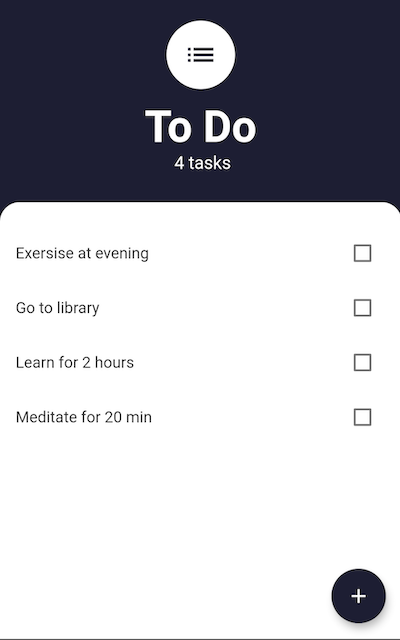
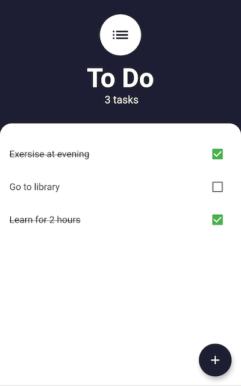
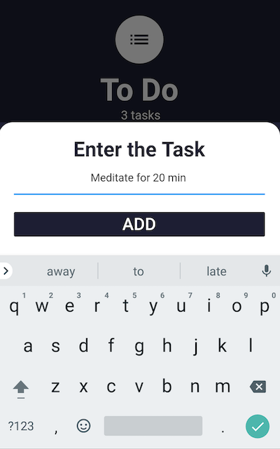

# ToDo
 A Todo app using flutter  
 This is cool little app which uses sqflite as database to store the todos locally. 
 Use the floating action button to add new task. 
 Check and uncheck the taskes which are done. 
 Long press on the tasks to delete that task from the list. 

 

